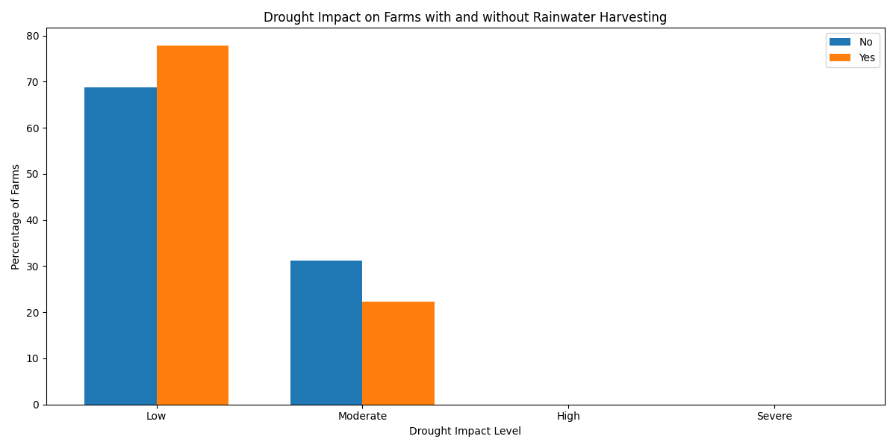

# Semi-Arid Farming Analysis

## Project Overview
This project analyzes the impact of rainwater harvesting systems on crop yields and drought resilience in semi-arid farming regions. Using data from various farms, we explore the relationship between rainfall, crop yield, and the effectiveness of water conservation techniques.

## Key Findings

### 1. Rainfall and Crop Yield Correlation
- A weak positive correlation (0.071) between annual rainfall and crop yield was observed.
- This suggests that factors beyond rainfall significantly influence crop productivity in semi-arid regions.

### 2. Rainwater Harvesting Systems Impact

- Farms with rainwater harvesting systems experience a higher percentage of low-impact drought conditions.
- Surprisingly, farms without these systems showed slightly higher average yields during both low and moderate drought impacts.
- No instances of high or severe drought impacts were recorded, suggesting the effectiveness of current water management strategies.

### 3. Statistical Analysis
- The differences in crop yields between farms with and without rainwater harvesting systems were not statistically significant.
- This held true for both low impact (p-value = 0.8474) and moderate impact (p-value = 0.3338) drought conditions.

## Implications for Water Distribution Efforts

1. **Integrated Approach**: While rainwater harvesting systems help mitigate drought severity, they should be integrated with other agricultural practices to improve overall crop productivity.

2. **Further Research Needed**: Investigation into complementary strategies such as soil management, crop selection, and advanced irrigation techniques could enhance the effectiveness of water conservation systems.

3. **Holistic Water Management**: Future water distribution efforts should focus on a holistic approach, combining rainwater harvesting with other sustainable farming practices.

4. **Data-Driven Decision Making**: Continuous data collection and analysis are crucial for optimizing water use and crop yields in semi-arid regions.

## Tools and Technologies Used
- Python
- Pandas for data analysis
- Matplotlib and Seaborn for data visualization
- SciPy for statistical testing

## Future Work
- Expand the dataset to include more diverse semi-arid regions
- Analyze the impact of specific crop types on water usage and yield
- Investigate the long-term economic benefits of rainwater harvesting systems
- Explore machine learning models for predicting optimal water management strategies

